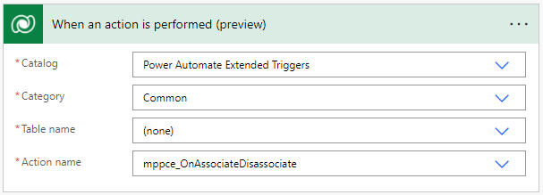

# Power Automate Extended Triggers

A collection of custom actions to effectively extend the available triggers for the [Microsoft Dataverse Connector](https://docs.microsoft.com/en-us/connectors/commondataserviceforapps/) for Power Automate.

## Introduction

At the time of writing, the Dataverse Connector only supports a limited number of triggers. Thankfully, "[When an action is performed (preview)](<https://docs.microsoft.com/en-us/connectors/commondataserviceforapps/#when-an-action-is-performed-(preview)>)" is one of them. This project defines several plugins that trigger actions when requests are received by the sandbox processing service, allowing Power Automate makers to define flows using an extended set of triggers.

## Actions

### On Associate / Disassociate

This action triggers whenever either of the Associate or Disassociate messages are received.



#### Inputs

- **Message:** Either "Associate" or "Disassociate"
- **Relationship:** Schema name of the relationship for which the event occurred.
- **Entity1:** The `Target` parameter of the request.
- **Entity2:** For each reference in the `RelatedEntities` parameter of the request, this action will be triggered with `Entity2` set to that reference.

You can configure your trigger to only fire for a specific message or relationship by specifying a trigger condition, like so:

```
@equals(triggerBody().InputParameters.Relationship, '<relationship schema name>')
```

#### Mirrored Execution

This action will be called twice for each associate / disassociate request, swapping the Entity1 and Entity2 input parameters for each call.

### On Publish

This action triggers whenever customizations are published.


#### Inputs

- **Message:** Either "Publish" or "PublishAll"
